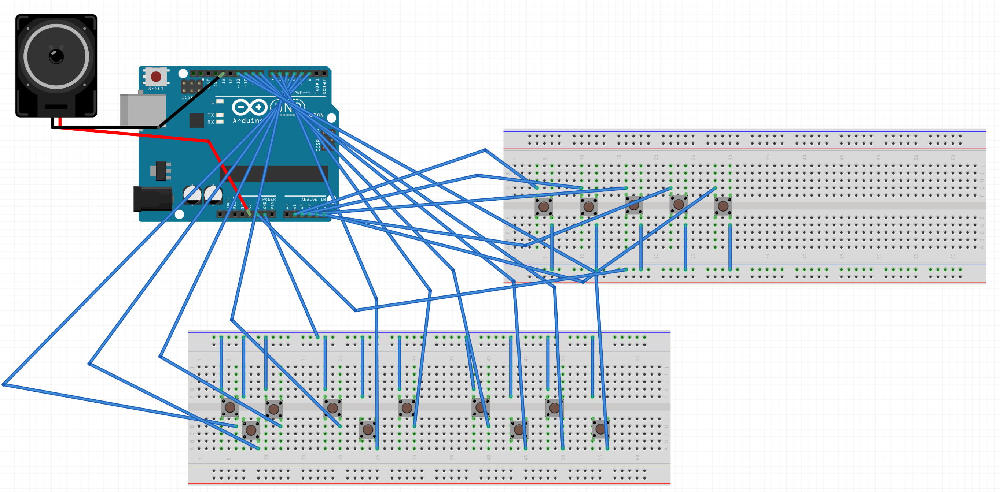

# FaxArduinoKeyboard 

## Info

- 📺 [YouTube Video](https://www.youtube.com/watch?v=fpLcKEWI9jA) · [Channel](https://www.youtube.com/channel/UCnOGTnk-kJi2h-Is11jxgoQ)
- ⬇️ [Direct Download: fax-redes3_EN.ino](https://github.com/C0m3b4ck/FaxArduinoKeyboard/blob/main/fax-redes3_EN.ino)
- 📦 [Previous Experiments Archive](https://github.com/C0m3b4ck/FaxArduinoKeyboard/releases/tag/experiment_dump_1)

## Wiring

| Pin Labels | Fritzing Sketch |
|:---:|:---:|
|  |  |

## Author

Started **March 14, 2026** by **C0m3b4ck** · Released **May 14, 2026**   
